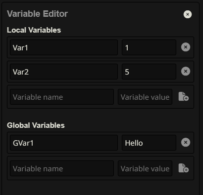

# Variable Editor

A SillyTavern extension for viewing and editing local and global variables in real-time.

## Features

- **Real-time synchronization**: Variables update automatically when changed externally
- **Local and Global variables**: Manage both chat-specific and persistent variables
- **Intuitive UI**: Clean interface with collapsible sections and visual feedback
- **Safe deletion**: Two-step confirmation process to prevent accidental deletions
- **Toast notifications**: User-friendly feedback for all operations

## Installation

Use ST's inbuilt extension installer with this URL:  
[https://github.com/Galfurian/st-variable-editor/](https://github.com/Galfurian/st-variable-editor/)

## Usage

1. Install the extension using the URL above
2. Type `/variableeditor` in the chat to open the panel
3. Use the panel to:
   - View all current variables
   - Add new variables using the bottom input fields
   - Edit existing variables by changing the name or value
   - Delete variables with the confirmation button (click once to confirm, click again to delete)

### Interface Overview

- **Local Variables**: Variables specific to the current chat
- **Global Variables**: Persistent variables across all chats
- **Add Row**: Empty fields at the bottom for adding new variables
- **Delete Button**: Red confirmation for safe deletion

## Requirements

SillyTavern version >=1.10.10

## Contributing

Feel free to open issues or submit pull requests on GitHub.
